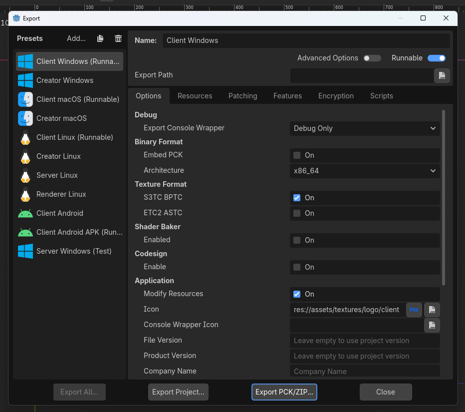

# Exporting Software

This page will guide you on how to build and export the final software.

1. On the root folder, Navigate to `Polytoria` (The Godot project)
2. Duplicate `export_presets.cfg.template` and rename it to `export_presets.cfg`
3. If you have Godot Editor open, restart it.
4. Go to `Project > Export...`. You should now be able to access build options from the template file.

