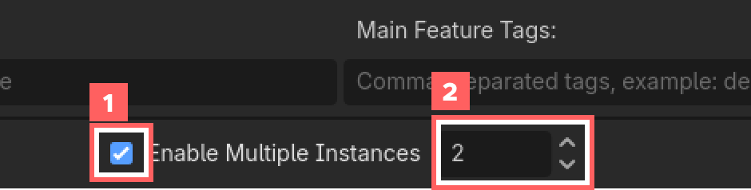
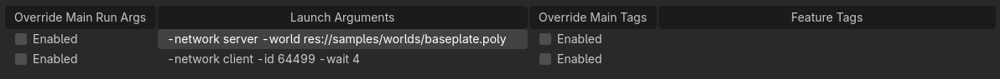
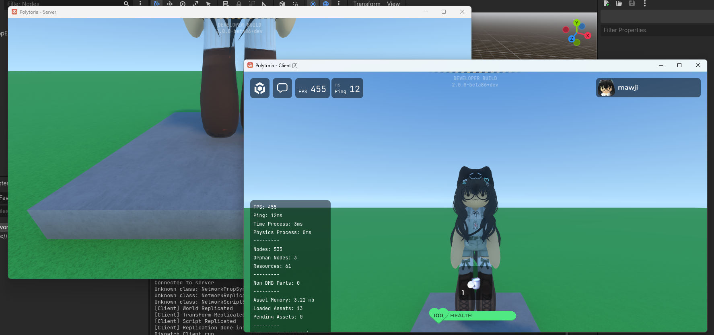

# Launching Clients

This guide walks you through how to run Polytoria Client locally for development.

1. Go to Debug > Customize Run Instances

{ width="600" }

2. Enable Multiple Instances, then set the instance count to 2

{ width="600" }

3. Set the launch arguments to the following



Instance 1:
```
-network server -world res://samples/worlds/baseplate.poly
```

Instance 2:
```
-network client -id 64499
```

!!! tip "About the ID"
    The ID can also be your user ID!

!!! failure "About Feature tags"
    Make sure the feature tags does not contain other entry flags (or just keep it empty!), we don't need them in client launching.

4. Press Run Project

{ width="300" }

...and there you go!

