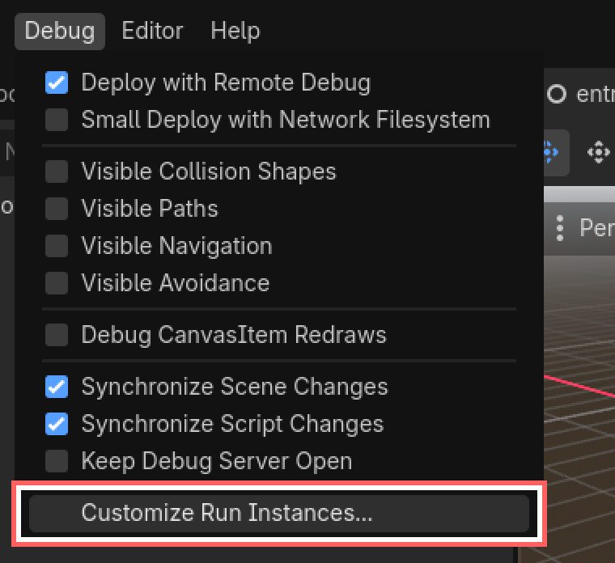
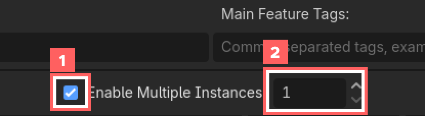
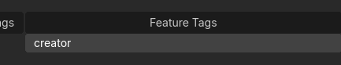
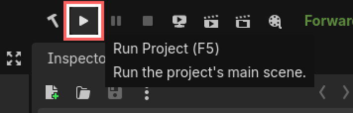
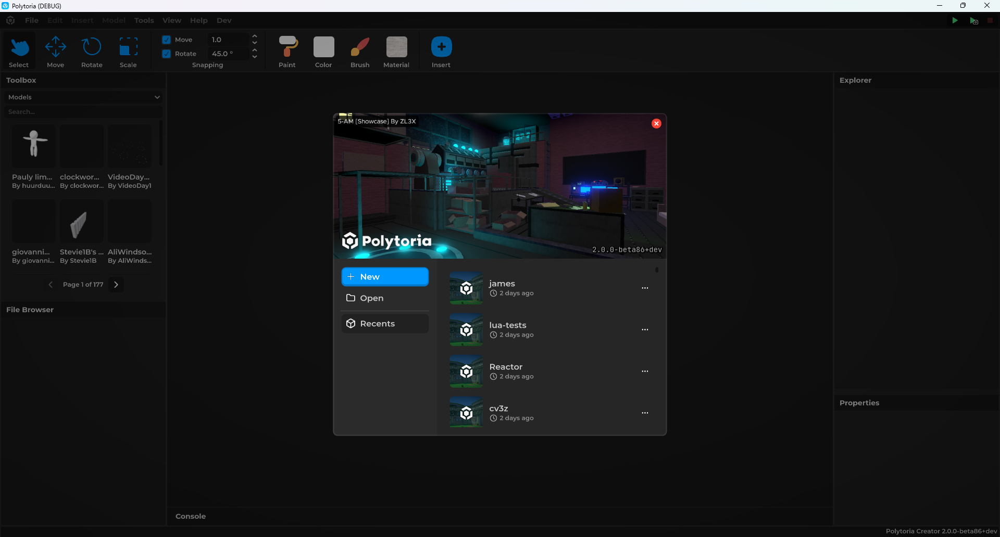

# Launching Creator

This guide walks you through how to run Polytoria Creator locally for development.

1. Go to Debug > Customize Run Instances

{ width="600" }

2. Enable Multiple Instances, then set the instance count to 1

3. Set the Feature Tags to `creator`

!!! tip "Tip! About the Launch arguments"
    You can keep the launch arguments from the client launch, no need to change anything!

4. Press Run Project

{ width="300" }

...and there you go!

