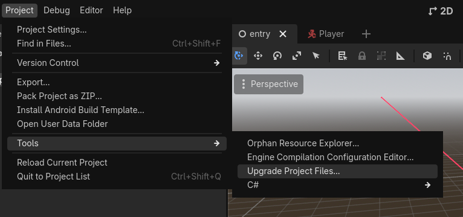

# Upgrading Godot Version

This page will guide you on how to upgrade the Godot version of the project, here's the remarks on the project's Godot version:

- The project should always be up-to-date with the latest stable version of Godot.
- An announcement should be made through the public channels to let other contributors know.

## Upgrading the project

1. [Download](https://godotengine.org/download/) the latest stable version of Godot (.NET)
2. Open the project using the latest version
3. Go to Project > Tools > Upgrade Project Files



4. Press Restart & Upgrade, and wait for upgrade process to complete
5. Don't commit yet! There's also CI to upgrade below:

## Upgrading the CI

1. Change `GODOT_VERSION` in `dm-test.yaml` and `export-checks.yml` to the latest stable version number (eg. `4.6.2`, `4.7`)

```yaml
name: "Datamodel Tests"
on:
  workflow_dispatch:

env:
  GODOT_VERSION: 4.6.2  <--------------------------- Here
  DOTNET_CLI_TELEMETRY_OPTOUT: true
  DOTNET_NOLOGO: true
```

2. Commit all these changes with appropriate commit message (eg. "Upgrade Godot -> 4.6.2")