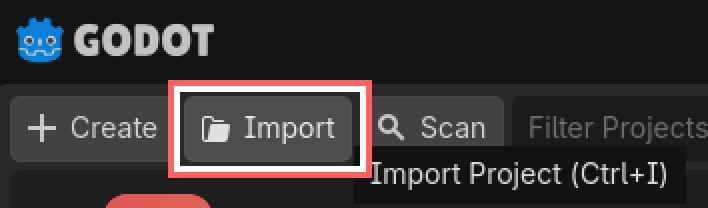
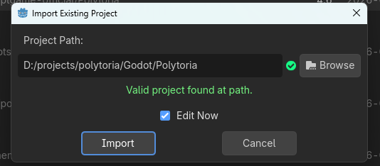

# Prerequisites

## Software & Toolchains

|Software|Download|
|--|--|
|Latest stable version of Godot Engine (.NET)|[Download](https://godotengine.org/download/)|
|.NET 10 SDK|[Download](https://dotnet.microsoft.com/en-us/download)|

## Getting the Source

1. Get started by cloning the Polytoria Github Repository

```
git clone https://github.com/Polytoria/polytoria-game.git
```

2. Launch Godot Engine, then import the cloned repository.

{ width="300" }

{ width="500" }

And then... you should be ready to go! You might want to try [launching the client](../launching/launching-clients/index.md) or [the creator](../launching/launching-creator/index.md) next.