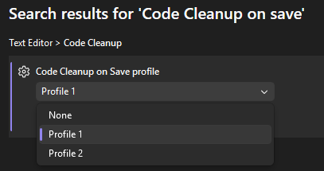
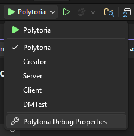
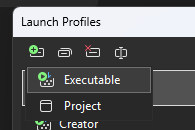
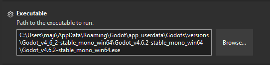
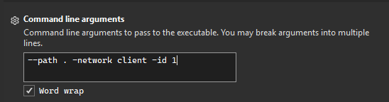
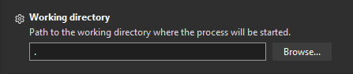
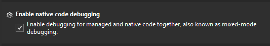

# Visual Studio

This guide will walk you through how to setup Godot with Visual Studio, this will include auto code-cleanup, linking with profiler, etc.

## Code cleanup on save

Code cleanup on save can save you time, you don't need to run `dotnet format` when finishing a commit every time.

1. Go to Tools > Options
2. Search "Code Cleanup on save"
3. Use the profile you preferred

## Linking run button with Godot

Linking run button with Godot will allow you to launch the application directly from Visual Studio itself, and allows you to use Visual Studio's profiler tools.

1. Open the run button dropdown, then choose "Polytoria Debug Properties"

2. Press on "Create new Profile", then choose "Executable"

3. In executable field, click browse and find your Godot executable, or paste path to your Godot executable

4. In command line arguments, add `--path .` to let Godot know the project to launch. For extra arguments, refer to [Command line arguments](../../launching/launching-clients/index.md)

5. Set Working Directory to `.`

6. Scroll down and Enable Native code debugging, this will allow you to debug Godot and Luau's side.

7. Press Run and it should now run the application with profiler attached! You can create more profiles to suit your needs.

!!! tip "Reminder"
    When upgrading your Godot version, don't forget to update your executable path!