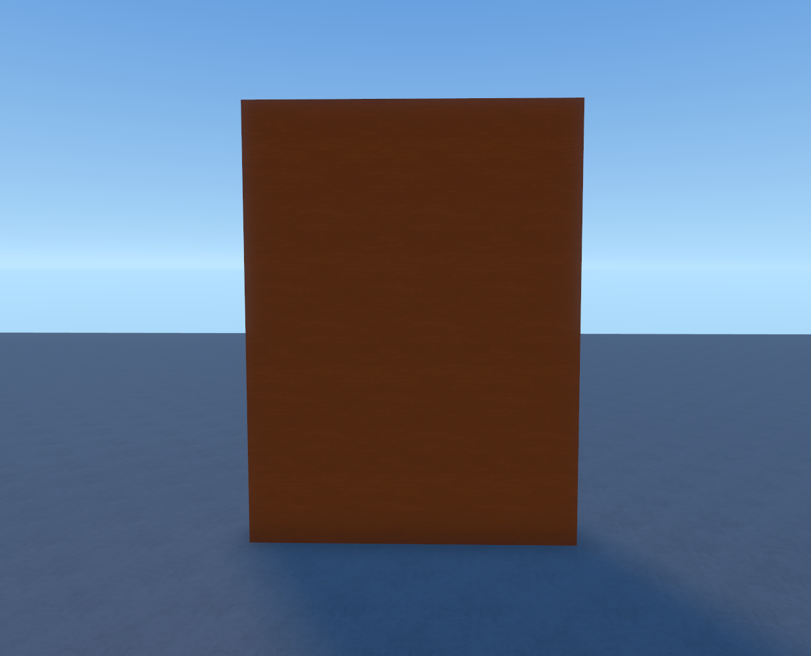
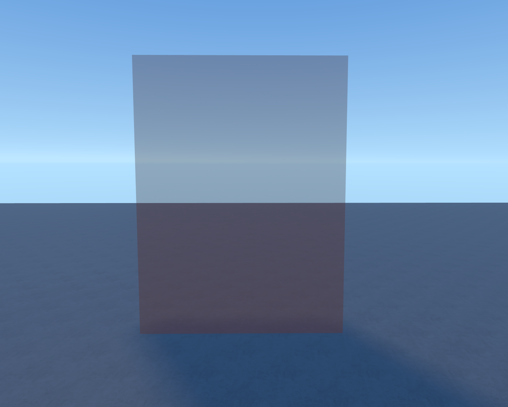

# Client-Server Communication

The client can't change server stuff directly, and the server can't read local input. A `NetworkEvent` is the bridge between them.

If you haven't read [Client vs Server](../client-server/index.md) yet, do that first.

## Setting Up

Drop a `NetworkEvent` into `Hidden` and name it.


## Client to Server

Pack your data into a `NetMessage`, then send it:

```lua
-- ClientScript
local event = Hidden.DoorEvent
local msg = NetMessage:New()
msg:AddString("action", "open")
event:InvokeServer(msg)
```

On the server, listen with `InvokedServer`:

```lua
-- ServerScript
local event = Hidden.DoorEvent

event.InvokedServer:Connect(function(sender: Player, msg: NetMessage)
    local action = msg:GetString("action")
    print(sender.Name .. " wants to " .. action)
end)
```

## Server to Client

Send data back to one player, or blast it to everyone:

```lua
-- ServerScript
event:InvokeClient(msg, player) -- one player
event:InvokeClients(msg)        -- everyone
```

On the client, listen with `InvokedClient`:

```lua
-- ClientScript
event.InvokedClient:Connect(function(msg: NetMessage)
    local damage = msg:GetNumber("damage")
    print("You took " .. damage .. " damage!")
end)
```

> Always check the data on the server. The client can send anything, so don't trust it blindly.

## Mini Project: Remote Door

1. Create a `NetworkEvent` named `DoorEvent`.
2. Create a `Part` named `Door`.

**ClientScript** (in a `ClientScript`):

```lua
local event = Hidden.DoorEvent

Input.KeyDown:Connect(function(keyCode, gameFocused)
    if keyCode == Enums.KeyCode.E then
        local msg = NetMessage:New()
        msg:AddString("action", "toggle")
        event:InvokeServer(msg)
    end
end)
```

**ServerScript** (in `ScriptService`):

```lua
local event = Hidden.DoorEvent
local door = Environment.Door

local isOpen = false

event.InvokedServer:Connect(function(sender: Player, msg: NetMessage)
    local action = msg:GetString("action")
    if action == "toggle" then
        isOpen = not isOpen
        local c = door.Color
        door.Color = Color.New(c.R, c.G, c.B, isOpen and 0.5 or 1)
        door.CanCollide = not isOpen
    end
end)
```

Walk up to the door and press **E**. It should open. Press it again and it closes.





---

Next: [Making a Tool](../making-a-tool/index.md) to build an item.
