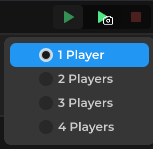

## Mini Project: The Color Button

Create a Part named `ColorButton` and put a `ClientScript` inside it:

```lua
-- ClientScript (inside ColorButton)
local button: Part = script.Parent

button.Touched:Connect(function(hit: Physical)
    button.Color = Color.Random()
end)
```

Run the game with two clients. Touch the button on one client, then look at the other. The colors do not match. The script ran on both machines independently. The server does not know what color either client picked.


> **Note:** it's right click on the play test button.

Now delete the `ClientScript` and create a `ServerScript`:

```lua
-- ServerScript (in ScriptService)
local button = Environment:WaitChild("ColorButton")

button.Touched:Connect(function(hit: Physical)
    button.Color = Color.Random()
end)
```

Run again. This time, touching the button changes the color for everyone, because the server ran the script once and replicated the change to every client.

## Why This Matters

Client changes are local only. That is fine for UI, camera effects, and anything that only that player needs to see. Server changes are seen by everyone. Use a `ServerScript` for anything that affects the whole game, like scores, positions, and game rules and datastores.

---

Next up: [Handling Player Input](../handling-input/index.md).
