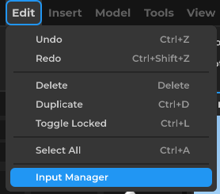
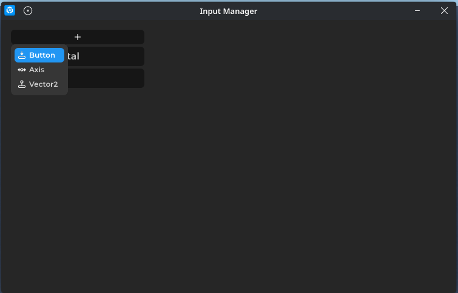
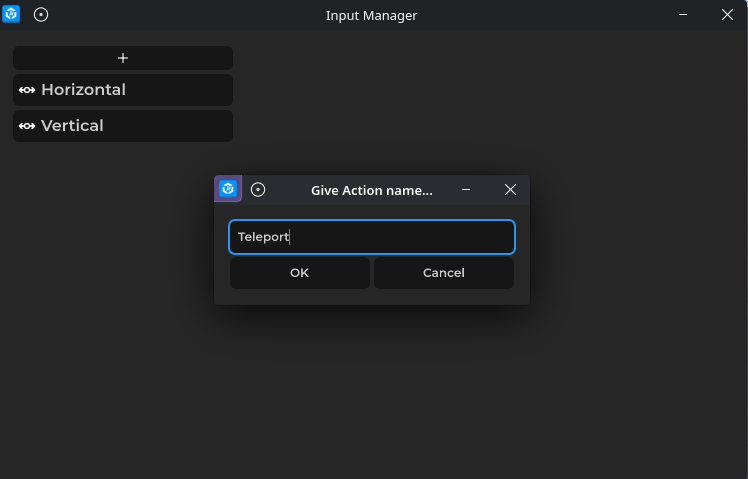
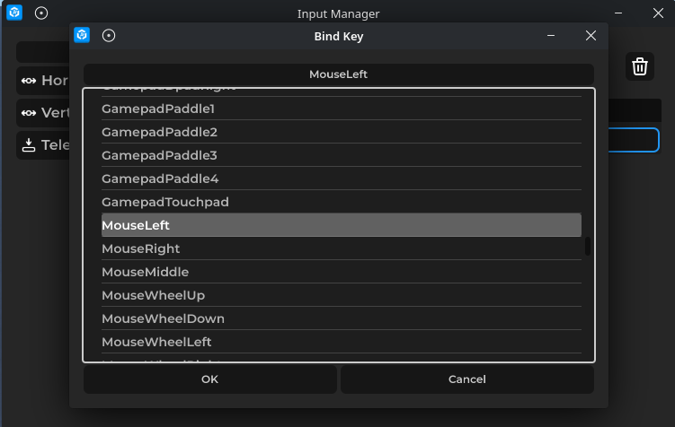
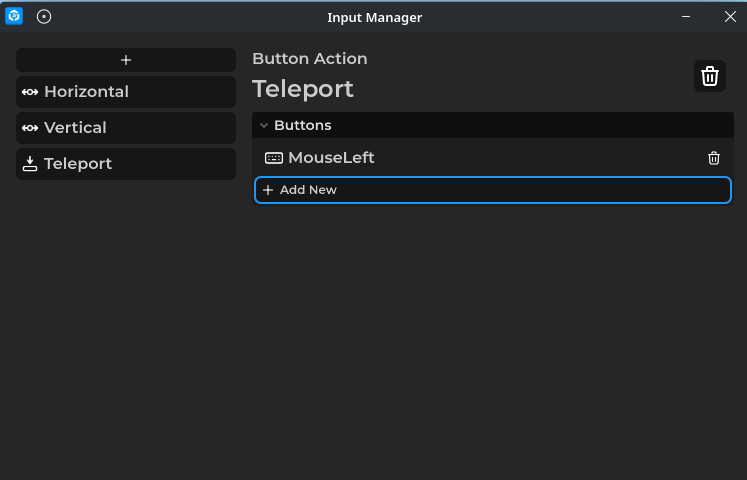

# Handling Player Input

Input Actions let you read what the player is doing without hard-coding specific keys. You set up the actions in the Input Manager, then read them in your ClientScripts.

> **Note:** Input can only be read in ClientScripts. ServerScripts cannot access player input directly.

Open the **Input Manager** from the **Edit** menu:



Click the **+** button and choose the action type you need (Button, Axis, or Vector2):



Give your action a name:



Bind it to a key or input:



Your finished action will appear in the list:



## Reading a Button

Say you created a Button action named "Interact". Here's how to check if it's held down:

```lua
-- ClientScript
function _Update()
    if Input:GetButton("Interact").IsPressed then
        print("Holding Interact!")
    end
end
```

## Fire Once Instead of Every Frame

Checking inside `_Update` runs every single frame while the key is held. If you only want something to happen once — like toggling a flashlight or opening a door — use the `Pressed` event instead:

```lua
local interact = Input:GetButton("Interact")

interact.Pressed:Connect(function()
    print("Interacted!")
end)
```

There's also `Released` if you need to know when the player lets go.

## Mini Project: Click to Teleport

Create a Button action named "Teleport" and bind it to **Mouse Left** in the Input Manager. Then drop this into a `ClientScript`:

```lua
local player = Players.LocalPlayer
local teleport = Input:GetButton("Teleport")

teleport.Pressed:Connect(function()
    local target = Input:GetMouseWorldPosition()
    if not target then
        return
    end

    -- Teleport the player 2 units above the clicked point so they dont get stuck
    target = target + Vector3.New(0, 2, 0)
    player.Position = target
end)
```

Run the game and left-click anywhere. Your character will jump to that spot.

> **Note:** For security reasons its recommend to handle this type of stuff using server scripts. [Client-Server Communication](../client-server-communication/index.md).

---

Next: [Client-Server Communication](../client-server-communication/index.md)
