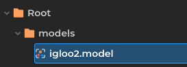
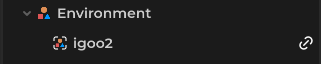
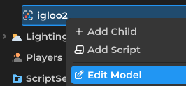
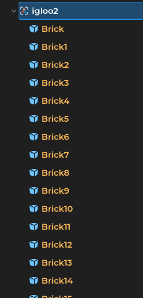
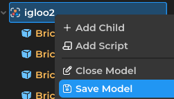

# Linked Models

Linked models serve as reusable objects in your worlds.

## Creating a Linked model

Simply drag your model into a folder inside the file browser. And there you have it, a linked model! Linked model will have the link icon appear in the explorer.

## Editing the Linked model

To edit a linked model, on explorer, right click on the model, then press "Edit Model". The model will be expandable and its children will appear in yellow.

## Saving the Linked model

After you finished editing the model, right click on the model, then click "Save Model". And there you go! If you have multiple models in the world, they'll update automatically. Optionally you can also choose to "Close Model" after you finish editing, reminder this will discard unsaved changes you made with the model.

## Current Limitations

- Root of the linked model's properties will not save during this time. For example if you make NPC a linked model, things like Health will not be saved and will be overridden by the world file.