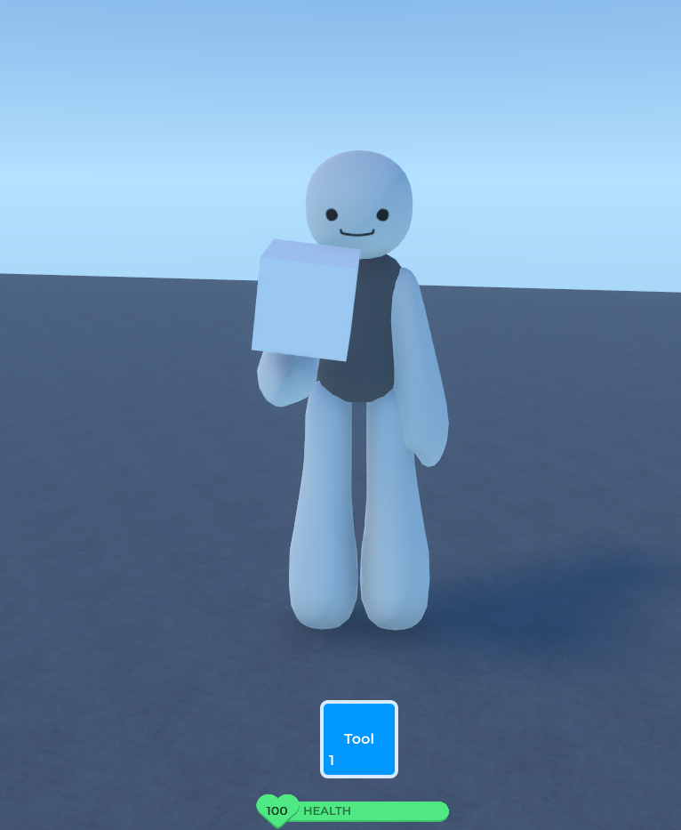

# Making a Tool

Tools are items players can pick up, equip, and use.

## Setting Up a Tool

1. Insert a `Tool` then parent it to a players `Inventory`.
2. Add a `Part` or `Mesh` inside the Tool as the handle. This is what players see in their hand.
3. Optional. Set the `IconImage` property so it shows up in the inventory bar.




## Equipping and Unequipping

These events fire when the player pulls out or puts away the tool:

```lua
local tool: Tool = script.Parent

tool.Equipped:Connect(function()
    print("Tool equipped!")
end)

tool.Unequipped:Connect(function()
    print("Tool put away.")
end)
```

## Activating the Tool

`Activated` fires when the player clicks while holding the tool. `Deactivated` fires when they release the mouse:

```lua
tool.Activated:Connect(function()
    print("Swing!")
end)
```

## Client + Server Logic

**ClientScript** (inside the Tool):

```lua
local tool = script.Parent
local event = Hidden:WaitChild("ToolEvent")

tool.Activated:Connect(function()
    tool:PlayAnimation("Swing")

    local msg = NetMessage:New()
    msg:AddString("action", "swing")
    event:InvokeServer(msg)
end)
```

**ServerScript** (in `ScriptService`):

```lua
local event = Hidden:WaitChild("ToolEvent")

event.InvokedServer:Connect(function(sender: Player, msg: NetMessage)
    local action = msg:GetString("action")
    if action == "swing" then
        print(sender.Name .. " swung the tool!")
        -- whatever here
    end
end)
```

## Mini Project: The Boop Stick

A simple tool that pushes a specifc part when you click.

1. Create a `Tool` named `BoopStick`.
2. Add a `Part` inside it for the handle.
3. Create a `NetworkEvent` named `BoopEvent` inside `Hidden`.
4. Place a unanchored `Part` named `Target` in the Environment.

**ClientScript** (inside BoopStick):

```lua
local tool = script.Parent
local event = Hidden:WaitChild("BoopEvent")

tool.Activated:Connect(function()
    tool:PlayAnimation("Swing")

    local msg = NetMessage:New()
    msg:AddString("action", "boop")
    event:InvokeServer(msg)
end)
```

**ServerScript** (in `ScriptService`):

```lua
local event = Hidden:WaitChild("BoopEvent")
local target = Environment:WaitChild("Target")

event.InvokedServer:Connect(function(sender: Player, msg: NetMessage)
    if msg:GetString("action") == "boop" then
        target.Velocity = Vector3.New(10, 10, 0)
        print("Boop!")
    end
end)
```

Click to send the target flying.

---

Next: [Saving Data with Datastores](../datastores/index.md) to keep player progress forever.
