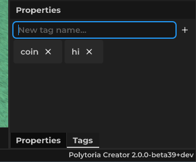

# About Tags

Tags are a set of strings which you can use to identify each instance. For example, you may identify an object as "coin". You can do so by adding a tag to the object. One instance can have multiple tags

## Adding tags via Creator

1. Select an Instance, then switch to tags menu in the properties window.
2. Type in tag name text field, then press the + plus icon
3. And there you have the tag! To remove, press the X icon next to the tag.



## Adding tags via Script
You can add a tag to an instance by using `Instance:AddTag(string)` and remove via `Instance:RemoveTag(string)`. For example:

```lua
coin:AddTag("interactable")
```

## Using tags
You can check if the object has the tag from the script using the `Instance:HasTag(string)` function which returns true if the object has the tag. Example usage:

```lua
player.Touched:Connect(function(hit: Physical)
    if hit:HasTag("coin") then
        coin += 1
    end
end)
```