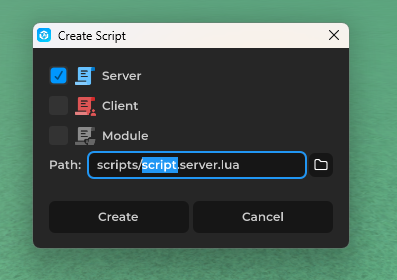
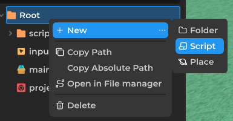
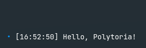

# Your First Script

This tutorial covers inserting a script and writing your first lines of code in [Luau](https://luau.org/). If you already know how to add a script, skip ahead to [The Script Editor](#hello-polytoria).

## Inserting a Script

### Via the Explorer

1. Right-click the object you want to add the script to.
2. Select **Add Script**.
3. Give your script a name. You can also specify which folder to create it in.
4. Press **Create** and you're done!




### Via the File Browser

1. Right-click a folder and select **New > Script**.
2. Give your script a name, just like in the Explorer.
3. Press **Create** and you're done!



The new script appears in the File Browser. You can also drag a script from the File Browser into the Explorer to attach it to an object.

## The Script Editor

Double-click the script to open the editor. This is where you write code.

## Hello, Polytoria

The classic first line. Paste this into a `ServerScript` and run the game:

```lua
print("Hello, Polytoria!")
```

Check the output window and you should see the message.



## Variables

Variables store values. Use `local` to create one:

```lua
local message = "Hello!"
local score = 0
local isReady = true
```

Polytoria also has object types. You can grab a reference to the script's parent like this:

```lua
local part: Part = script.Parent
print(part.Name)
```

## Functions

Functions are reusable blocks of code:

```lua
local function greet(name: string)
    print("Hello, " .. name .. "!")
end

greet("Polytoria")
```

## Events

Events let you run code when something happens. The `Touched` event fires when a `Physical` object touches the part:

```lua
local part: Part = script.Parent

part.Touched:Connect(function(hit: Physical)
    print(part.Name .. " was touched by " .. hit.Name)
end)
```

## Mini Project: Color Changing Part

Put it all together. Create a `Part` in the Environment, insert a `ServerScript` inside it, and paste this:

```lua
local part: Part = script.Parent

part.Touched:Connect(function(hit: Physical)
    part.Color = Color.Random()
    print(part.Name .. " changed color!")
end)
```

Run the game and walk into the part. It should flash a random color every time something touches it.

---

That's the basics. read [Client vs Server](../client-server/index.md).
